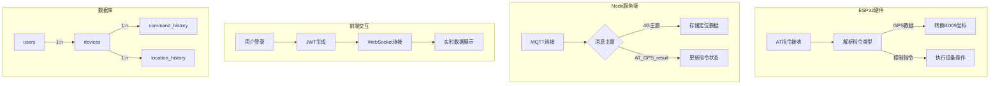

# 系统流程图说明

```mermaid
flowchart TD
subgraph ESP32硬件
A[AT指令接收] --> B[解析指令类型]
B -->|GPS数据| C[转换BD09坐标]
B -->|控制指令| D[执行设备操作]
end

subgraph Node服务端
E[MQTT连接] --> F{消息主题}
F -->|4G主题| G[存储定位数据]
F -->|AT_GPS_result| H[更新指令状态]
end

subgraph 前端交互
I[用户登录] --> J[JWT生成]
J --> K[WebSocket连接]
K --> L[实时数据展示]
end

subgraph 数据库
M[users] -->|1:n| N[devices]
N -->|1:n| O[command_history]
N -->|1:n| P[location_history]
end
```

## 流程对应关系
1. ESP32部分对应`esp32.ino`的AT指令处理逻辑
2. 服务端路由对应`app.js`的MQTT消息处理模块
3. 前端交互对应`login.js`和`console.js`的鉴权机制
4. 数据库结构对应`init.sql`的表关系设计